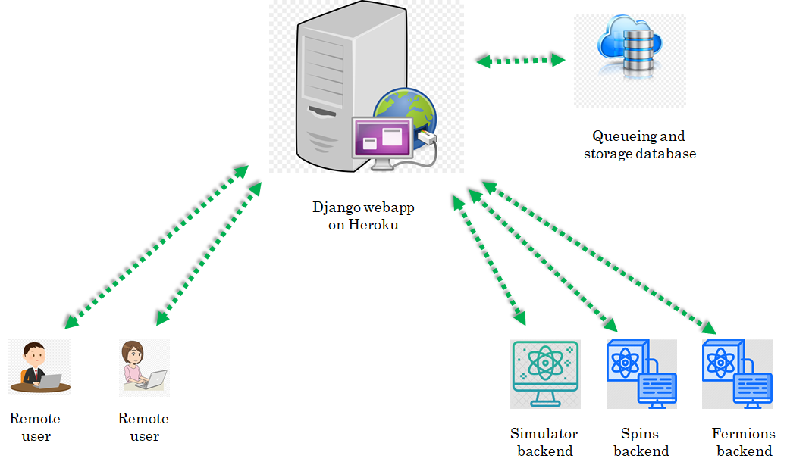

# General description
## The big picture
The idea for developing [qlued][qlue_github] stems from the desire for unifying experiment execution on different platforms for quantum simulation/computation. These platforms can be based on different technologies (e.g. neutral atoms, ions, superconducting qubits, photonic systems etc.) and have different software for experiment control.

In this diversity there is a unifying feature for different experiments, they essentially act as a backend for executing some instructions. On adopting this picture we quickly realise that we become totally agnostic to the details of how the instructions are executed on a hardware if we can provide a general higher level description of the experiments. A very suitable high-level description for experiments on different platforms is to think of these experiments as quantum circuits. In this picture any experiment essentially has three steps : state preparation, unitary evolution under a given Hamiltonian and measurement. Infact we are not just limited to experiments anymore and can even include theoretical simulator backends which execute the quantum circuits on a computer.

For providing software support for a given backend to use the language of quantum circuits, two types of libraries are required : one which allows to write quantum circuits for the experiments using some kind of quantum circuit framework and a second one for parsing the quantum circuits into a format which can be run on the experiment. For the first one, there already exists quantum circuit frameworks like [Qiskit][Qiskit_github], [Pennylane][Pennylane_github] etc. which provide a comprehensive support for writing quantum circuits. For the second one, custom code has to be written which will depend on the details of the particular backend.

Another important point is that we assume that the user who writes the quantum circuits does not necessarily have local access to experiments. So the user submits quantum circuits to the backend remotely over the internet. We use the word job for the submissions by the remote user. Therefore, we also need a service which can act as the central point for various remote users to submit their jobs or fetch the result/status of their previously submitted jobs. For security reasons this service should provide robust user management and authentication.

To address the issue we have developed a web interface called [qlued][qlue_github] which allows remote users to submit their jobs to remote cold atom backends. This architecture has several advantages :

* The same circuit can be executed on different backends.
* Makes collaboration between researchers easier.
* A nice tool for teaching.

## A use case
We want to use our quantum computing backends as platforms for executing experiments written as quantum circuits. These backends can be a real cold atom machine or a simulator running on a computer . But how will the backend understand a quantum circuit? For e.g. in our experiment we use the [labscript suite][labscript_github] to control all hardware and for data analysis. We need to tackle the following issues:

* Labscript suite does not have native support for writing quantum circuits.
* We want to allow remote users to be able to submit jobs to our backends. So we need a server architecture and user management.

The above issues can also exist for a simulator package. Hence the need for [this project][qlue_github]. There are two sides : [client](#the-client) and [server](#the-server).

## The client
A client is a remote user who will write quantum circuits in the user's favorite quantum circuit framework ([Qiskit][Qiskit_github], [Pennylane][Pennylane_github], ...). These circuits then have to be compiled into JSON files. The JSON files can be sent over the internet to a remote server which will queue it for parsing/execution on the backend. The backend can be a real cold atom machine or a simulator running on a computer. To get credentials, user has to create an account at a qlued instance like [qlued.alqor.io](https://qlued.alqor.io/).

We have decided on a schema for the JSON files. See [1][eggerdj_github]  for more details. The document mentions in detail how things should be formatted. We also provide extensive tutorials that work without the SDKs [here](../../notebooks/rydberg_api_showcase_v2).

The plugin for compiling Qiskit circuits to JSON files is available at [``qiskit-cold-atom``](https://github.com/Qiskit-Extensions/qiskit-cold-atom). Similarly the plugin for compiling a pennylane circuit into JSON is available at [``pennylane-ls``][synqs_pennylane_github]. Note that the pennylane plugin at [``pennylane-ls``][synqs_pennylane_github] already offers several backends. Each backend is a device with its own operations.

That's all that is required on the client side. Basically choose one of these frameworks. If the client wants to use a different quantum circuit framework, then the client must write appropriate code for compiling quantum circuits of that framework into JSON files which follow the schema of [1][eggerdj_github].

## The server
Here we describe 3 parts:

* The Django app (`qlued`).
* The storage.
* The backends.

### The Django app (qlued)
The [Heroku][Heroku] platform hosts our [Django][Django_github] app. Django is a Python-based free and open-source web framework. It uses the Model-View-Template architecture:

* Model : Build databases from classes with the help of Object Relational Mapper (ORM).
* View : Function executed whenever a particular URL receives an HTTP request. For every URL there is a corresponding view function.
* Template : HTML/CSS code for inserting web elements in a HTML document.

Note that [Django][Django_github] is just a framework to design web-apps. Its not a server by itself. After writing a webapp it has to be hosted on a server. Although, Django also comes with a built-in server but this is meant only for local testing and development. In production environment one must use a proper server like [Apache web server][Apache], [Gunicorn][Gunicorn], [waitress][Waitress_github] etc. to host the webapp. For e.g. our Django app is hosted on a [Gunicorn][Gunicorn] server on the [Heroku][Heroku] platform.

Another point is that although we have a Django webapp running on our server, it is functionally equivalent to a REST API. REST API is a popular architecture of communicating with remote servers. [Django Rest Framework][DRF] is widely used for writing such REST APIs. However, here we choose to work with [django-ninja](https://django-ninja.rest-framework.com/) for the sake of simplicity and speed.

Before describing the server in detail, lets mention that for the client, communicating with the server essentially boils down to sending correct HTTP request to the correct URL. Then on the server side Django will execute the view function corresponding to that URL. The structure of a general URL looks like :

``
server_domain/requested_backend/appropriate_view_name
``

So for example if the ``server_domain=https://qlued.alqor.io/api/v2``, and we want to use ``post_job`` view for the ``fermions`` backend i.e.  ``requested_backend=fermions`` and ``appropriate_view_name=post_job``. The complete URL will look like :

``
https://qlued.alqor.io/api/v2/fermions/post_job/
``

### The API

A automatically generated documentation of the API can be found [here](https://qlued.alqor.io/api/v2/docs). Here, we explain different view functions and their purpose in slightly more detail:

* **The `get_config` view** : This function returns a JSON dictionary containing the backend capabilities and details. At the moment this is relevant only for the Qiskit plugin as the pennylane plugin does not make use of it.
* **The `post_job` view** : This function extracts the JSON dictionary describing a potential experiment from a HTTP request. The extracted job_JSON is dumped onto **Dropbox** for further processing. It then responds with another JSON dictionary which has a ``job_id`` key. This job_id is important to query the server for results of the experiment later on. A typical JSON response from the server has the following schema:
``
{'job_id': 'something','status': 'something','detail': 'something'}
``
* **The `get_job_status` view** : This function extracts the job_id of a previously submitted job from a HTTP request. It responds with a JSON dictionary describing the status.
* **The `get_job_result` view** : This function extracts the job_id of a previously submitted job from a HTTP request. If the job has not finished running and results are unavailable, it responds with a JSON dictionary describing the status. Otherwise it responds with a JSON dictionary describing the result. The formatting of the result dictionary is described in [1][eggerdj_github].

We will frequently use the term status dictionary and result dictionary. These are just text files which host the appropriate JSON data. These files are stored on the Dropbox like job_JSON. When a view reads these text files, it coverts the data in them to a python dictionary and sends it to the client or modifies the dictionary further before saving it back to the text file.

Since we use MongoDB or Dropbox to store JSONs, the view functions call functions written in a file called ``storage_providers.py`` which in turn calls  API functions for reading and writing. Note that we currently provide storage with MongoDB by default or Dropbox. However, it can be **replaced** with any other storage service (like Amazon S3, Microsoft azure storage, Google cloud storage etc.) which allows a user to read and write content using a python API. For this one would need to implement four basic functions for accessing the cloud storage provider. The details of these four functions are given in ``storage_providers.py`` with an example implementation for Dropbox. A new storage service can have its own class inheriting from the base class (just like the Dropbox class) and override the base functions.

## The storage

!!! note

    Beware, we have recently updated the default storage to mongoDb. The following description is outdated. However, the main idea is still the same. We will update the description soon.

This completes the execution of the job and the results are now available.

## The backends
The backend can be a real cold atom machine or a simulator running on a computer. In summary, the backend runs a spooler which is responsible for executing job_JSONs and updating status_JSONs and result_JSONs. However different backends have different Spoolers. The Spoolers of different simulator backends have similar structure. The experiment backends have slightly different implementation of spoolers. This is because simulators and real machine operate in different conditions. We first describe the simulator backend and then the experiment one.

#### The simulator backend
This is just a PC running spooler(s). It is typically based on any kind of implementation like the `sqooler`package. For more information see [here](https://alqor-ug.github.io/sqooler/).

#### The experiment backend
A first draft for implementing the experiment backends is highlighted [here][labscript_qc]. The code was tested to perform MOT loading in a cold atom machine in Heidelberg by submitting circuits from Zurich. Although we still need to polish this part of the code, it already highlights important ideas on how to connect a real cold atom machine to [qlue][qlue_github].

[qlue_github]: https://github.com/synqs/qlue "qlue"
[Qiskit_github]: https://github.com/Qiskit "Qiskit"
[Pennylane_github]: https://github.com/PennyLaneAI "Pennylane"
[eggerdj_github]: https://github.com/eggerdj/backends/ "Qiskit_json"
[synqs_pennylane_github]: https://github.com/synqs/pennylane-ls "penny_json"
[Heroku]: https://www.heroku.com/home "Heroku"
[Waitress_github]: https://github.com/Pylons/waitress "Waitress"
[Django_github]: https://github.com/django "Django"
[Apache]: https://httpd.apache.org/ "Apache"
[Gunicorn]: https://gunicorn.org/ "Gunicorn"
[DRF]: https://github.com/encode/django-rest-framework "DRF"
[labscript_github]: https://github.com/labscript-suite "labscript"
[labscript_qc]: https://github.com/synqs/labscript-qc "labscript-qc"
