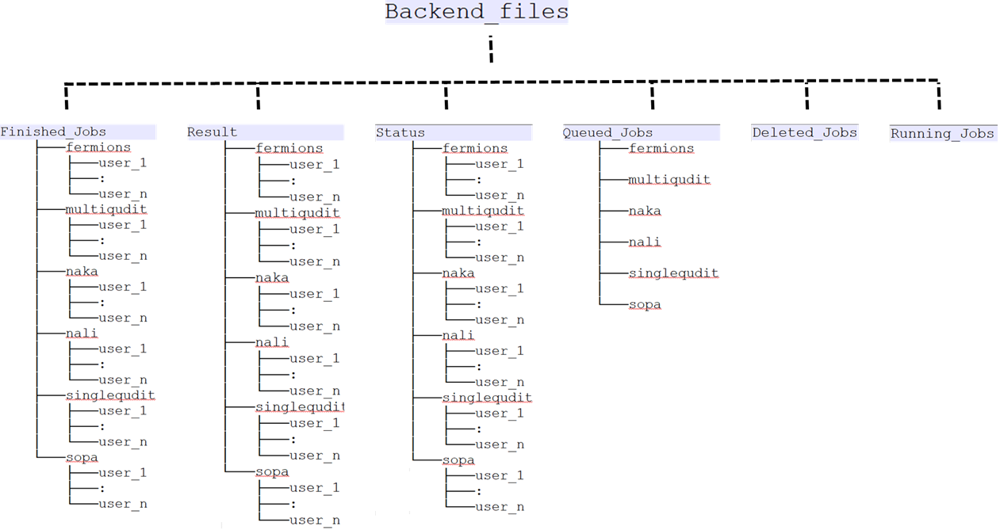

# Storage providers

We use external storage providers like Dropbox or MongoDB to store all our JSONs. All the source code is stored in `backends/storage_providers.py`. Below, we will summarize how the storage providers are supposed to work and how they can be set up.

## Some general remarks 

To store the jobs with an external storage provider has several benefits:

* We immediately implement asynchronous job management. Basically the server dumps the job coming from the remote client onto the storage provider. Then whenever the spooler belonging to a backend is free, it will act on the next job which is appropriate for that particular backend.
* The storage_provider also serves as a database storage for various JSONs, like job_JSON, result_JSON, status_JSON etc. 
* It allows us to unify the workflow for both simulator and real machine. Basically it does not matter what the backend is, the workflow is the identical. Different backends only differ in their Spoolers.


Now lets give an example about the work flow. Lets say a remote client named ``user_1`` submits a job to the singlequdit backend. This means ``user_1`` sent a  post request to the following URL:

``
https://qlued.alqor.io/api/v2/singlequdit/post_job/
``

The server will immediately save the JSON to the storage_provider via `upload_job`. At the same time the server will reply to the user with a job_id response which might look something like :

```json
{
    "job_id": "20210906_203730-singlequdit-user_1-1088f",
    "status": "INITIALIZING",
    "detail": "Got your json."
}
```

This dictionary is also saved as a status JSON via `upload_status`. 

On the spooler side, it will query the server for the next job it should work on. Also let us suppose the spooler is querying about the next job for ``singlequdit`` backend. The server looks for the file list in the directory ``Backend_files/Queued_Jobs/singlequdit/``. It will choose the first created file from that list. Lets say this is the file ``job-20210906_203730-singlequdit-user_1-1088f.json``. Now the server will move this file from ``Backend_files/Queued_Jobs/singlequdit/job-20210906_203730-singlequdit-user_1-1088f.json`` to ``Backend_files/Running_Jobs/job-20210906_203730-singlequdit-user_1-1088f.json`` and respond to the spooler with a ``job_msg_dict`` which looks like

```json
{
    "job_id": "20210906_203730-singlequdit-user_1-1088f", 
    "job_json": "Backend_files/Running_Jobs/job-20210906_203730-singlequdit-user_1-1088f.json"
}
```

From this, the Spooler knows exactly where the job JSON file is stored on Dropbox. It fetches the job JSON and starts to process it.

For processing the job, the spooler begins by sanity-checking the JSON for correct schema. If the job_JSON fails this check the file is moved to  `` Backend_files/Deleted_Jobs/job-20210906_203730-singlequdit-user_1-1088f.json ``. The status JSON is also updated by the spooler to:

```json
{
    "job_id": "20210906_203730-singlequdit-user_1-1088f",
    "status": "ERROR",
    "detail": "Got your json.; Failed json sanity check. File will be deleted. Error message : blah..blah"
}
```

From the dictionary, the user is automatically informed about the details of why the error happened.

If however, the job_JSON passes sanity checking, then it is executed. The spooler goes through the instruction list and creates the appropriate circuit and calculates the end result. Then it generates the given number of shots and formats everything into the result dictionary. The schema of the result dictionary is given at [1][eggerdj_github]. Then the Spooler will upload the result JSON to the appropiate place (see the `sqooler` instructions for more detail). It will also move the job JSON `running_jobs` to `finished_jobs`. Finally the spooler will update the status JSON to:

```json
{
    "job_id": "20210906_203730-singlequdit-user_1-1088f",
    "status": "DONE",
    "detail": "Got your json.; Passed json sanity check; Compilation done. Shots sent to solver."
}
```

## Setting up a new MongoDB storage

`qlued` allows you to use [MongoDB](https://www.mongodb.com/) storage [^1]. Several options for hosting a mongoDB database are available. If you would like to deploy the system, we recommend to use [MongoDB Atlas](https://www.mongodb.com/cloud/atlas). However, it is also possible to set up a local MongoDB database. In the following, we will explain how to set up a MongoDB Atlas database (help to improve this description is welcome):

[^1]: The full logic is encoded in the `MongodbProvider` class within `backends/storage_providers`.

- Create an account on [MongoDB Atlas](https://www.mongodb.com/cloud/atlas).
- Create a new project.
- Create a new cluster.
- Create a new user.
- Obtain the url of the database through connect -> driver -> python and there copy the url.

### Adding the MongoDB to the admin interface
Now you are ready to add the storage to `qlued`. To do so, make sure that you have access to the admin interface of your instance. If you are not sure, we have a guide on how to deploy the service via heroku [here](heroku.md) or create a local instance as described [here](local_installation.md). Follow the steps below:

- Log in to the Django admin interface.
- Under backends you should see a `Storage Provider dbs` section. Click on it.
- Click on `Add Storage Provider db`.
- As Storage Type choose `MongoDB`.
- Use the name of your choice.
- Assign an owner.
- Provide a description.

Finally, you have to add the login information. For the moment this is a json dict. So fill in the following dict:

```json
{"mongodb_username": "<YOUR-USERNAME>", 
"mongodb_password": "<YOUR-PASSWORD>", 
"mongodb_database_url": "<YOUR-DATABASE-URL>"}
```

- Save the storage provider.

### Deploy with MongoDB 

Your are done and the backends that have been added to the storage should be visible under the devices section of the frontend.

!!! note

    If you did not set up the `sqooler` you are going to get several errors. This is due to the fact that `sqooler` will define the backend configurations. So try to install it as described [here](https://alqor-ug.github.io/sqooler/) and run the tests again. 

## Setting up a new dropbox storage
Dropbox is the second option as a `StorageProvider`. This is more direct as a file system, however it has some severe performance handicaps compared to MongoDB. Now we describe how the Dropbox folder structure is organized. It is shown in following picture:
 If one plans to replace Dropbox with other storage service, then one needs to implement a folder/naming structure similar to above.


If you would like to set it up you have to follow these steps (help to improve this description is welcome):

- Make sure that you have a Dropbox account.
- Create an app in [app console](https://www.dropbox.com/developers/apps).
- Give the app the permissions `files.content.write` as well as `files.content.read`.


### Obtain the refresh token

Next we explain you how to  obtain the `REFRESH_TOKEN`. This is initially based on [this guide](https://www.dropboxforum.com/t5/Dropbox-API-Support-Feedback/Get-refresh-token-from-access-token/td-p/596739).

1. Make your OAuth app authorization URL like this: (plug in your app key in place of "APPKEYHERE"):
```
https://www.dropbox.com/oauth2/authorize?client_id=APPKEYHERE&response_type=code&token_access_type=offline
```
2. Browse to that page in your browser while signed in to your account and click "Allow" to authorize it.
3. Copy the resulting authorization code.
4. Exchange the authorization code for an access token and refresh token like this, e.g., using curl on the command line: (plug in the authorization code from step 3 in place of "AUTHORIZATIONCODEHERE", the app key in place of "APPKEYHERE", and the app secret in place of "APPSECRETHERE").
```
curl https://api.dropbox.com/oauth2/token \
    -d code=AUTHORIZATIONCODEHERE \
    -d grant_type=authorization_code \
    -u APPKEYHERE:APPSECRETHERE​
```
The response will contain a short-lived access token and refresh token that you can then use as needed.

### Adding the Dropbox to the admin interface

Now you are ready to add the storage to `qlued`. To do so, make sure that you have access to the admin interface of your instance. If you are not sure, we have a guide on how to deploy the service via heroku [here](heroku.md) or create a local instance as described [here](local_installation.md). Follow the steps below:

- Log in to the Django admin interface.
- Under backends you should see a `Storage Provider dbs` section. Click on it.
- Click on `Add Storage Provider db`.
- As Storage Type choose `MongoDB`.
- Use the name of your choice.
- Assign an owner.
- Provide a description.

Finally, you have to add the login information. For the moment this is a json dict. So fill in the following dict:

```json
{
    "app_key": "<YOUR-APP-KEY>",
    "app_secret": "<YOUR-APP-SECRET>",
    "refresh_token": "<YOUR-REFRESH-SECRET>",
}
```

- Save the storage provider.

## Setting up a local storage

!!! note
    This local storage is not usable for production. It is only for testing purposes at the moment.

Local storages are a third option as a `StorageProvider`. This is directly dumping the jobs onto your file system and is therefore super fast, direct and simple to maintain[^2]. However, it comes with severe limitations:


[^2]: No need to install some servers, register etc.

- Currently, we have not connected it to `sqooler`. So it is really just for testing.
- Given that the files are stored on the hard drive that also runs the server it is directly exposed to the internet. This makes it substantially more easy for external attackers to wreck your hardware. 

Finally, you have to add the login information. For the moment this is a json dict. So fill in the following dict:

```json
{
    "base_path": "<YOUR-BASEPATH>"
}
```

## Done
This ends the set up of the server. You can now run the first tutorials as explained [here](notebooks/rydberg_api_showcase_v2)